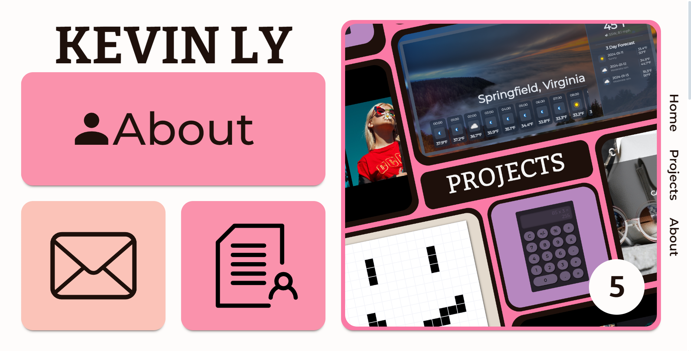

# Personal-PortfolioV2
A Personal Portfolio Website containing projects, skills, and contacts.

## Table of Contents
- [Installation](#installation)
- [Features](#features)
- [Tech Stack](#tech-stack)
- [License](#license)

## Installation
1. Clone the repository: git clone https://github.com/Ama4538/Personal-PortfolioV2.git
2. Install dependencies: npm install
3. Run built in script: npm run build
4. Open on localHost: npm run preview

## Features
- Responsive
- Dynamic project addition via data json
- Dynamic Nav bar addition via nav element array in nav
- Subtle animations

## Tech Stack
- React
- CSS

## License
Distributed under the MIT License. See `LICENSE` for more information.